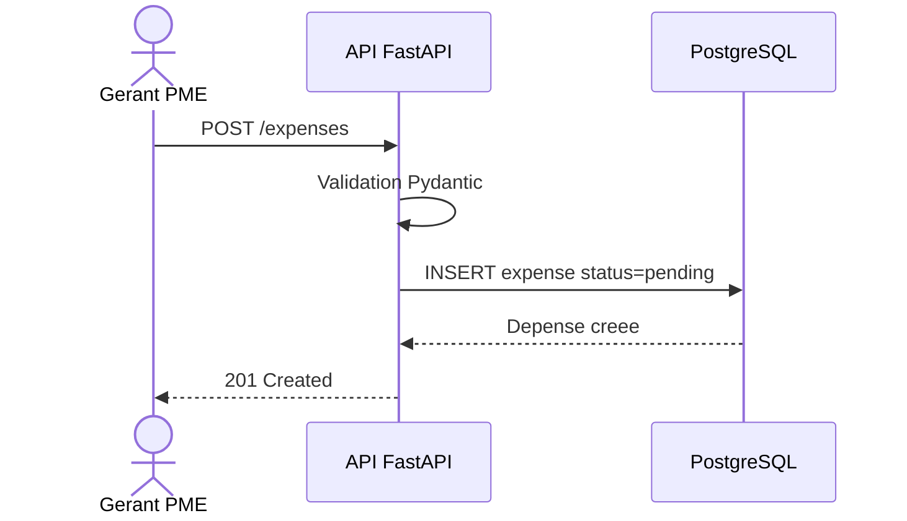
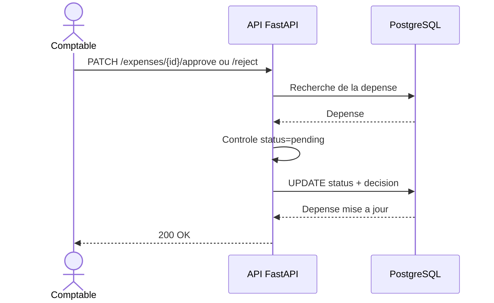

# Conception - Fonctionnalite Gestion des depenses

## Objectif

Permettre au Gerant PME de saisir une depense, puis au Comptable de la valider ou de la refuser.

## Acteurs

| Acteur | Responsabilites |
| --- | --- |
| Gerant PME | Saisit les depenses de sa PME et consulte leur statut |
| Comptable | Consulte les depenses, les categorise, les valide ou les refuse |
| Admin | Configure les categories et garde une vision globale |

## Regles metier

- Une depense est creee avec le statut `pending`.
- Une depense peut etre validee uniquement si elle est encore `pending`.
- Une depense peut etre refusee uniquement si elle est encore `pending`.
- Apres validation ou refus, la depense ne peut plus changer de statut.
- Le montant doit etre strictement positif.
- Une depense appartient a une PME via `pme_id`.
- Le nom du gerant et le nom du comptable sont conserves pour assurer la tracabilite.

## Modele logique de donnees

Table `expenses`

| Champ | Type | Description |
| --- | --- | --- |
| id | integer | Identifiant unique |
| pme_id | integer | Identifiant de la PME |
| title | varchar(150) | Titre de la depense |
| description | text | Detail optionnel |
| category | varchar(100) | Categorie comptable |
| amount | numeric(12,2) | Montant de la depense |
| expense_date | date | Date de la depense |
| receipt_url | varchar(255) | Lien optionnel vers le justificatif |
| status | enum | `pending`, `approved`, `rejected` |
| created_by_role | varchar(50) | Role createur, par defaut `gerant_pme` |
| created_by_name | varchar(100) | Nom du createur |
| decision_by_role | varchar(50) | Role decisionnaire, par defaut `comptable` |
| decision_by_name | varchar(100) | Nom du decisionnaire |
| decision_comment | text | Commentaire de validation ou refus |
| created_at | datetime | Date de creation |
| updated_at | datetime | Date de modification |

## Diagramme de sequence - creation



## Diagramme de sequence - validation/refus



## Endpoints developpes

| Methode | Route | Description |
| --- | --- | --- |
| POST | `/expenses` | Creer une depense |
| GET | `/expenses` | Lister les depenses |
| GET | `/expenses/{expense_id}` | Consulter une depense |
| PATCH | `/expenses/{expense_id}/approve` | Valider une depense |
| PATCH | `/expenses/{expense_id}/reject` | Refuser une depense |

## Tests unitaires minimum

Les tests couvrent :

- creation d'une depense ;
- validation d'une depense ;
- impossibilite de refuser une depense deja traitee.

Commande :

```bash
pytest
```

