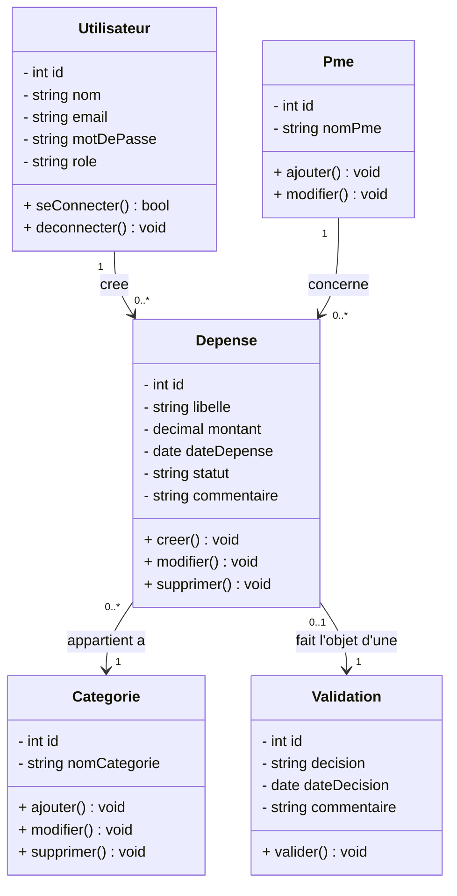
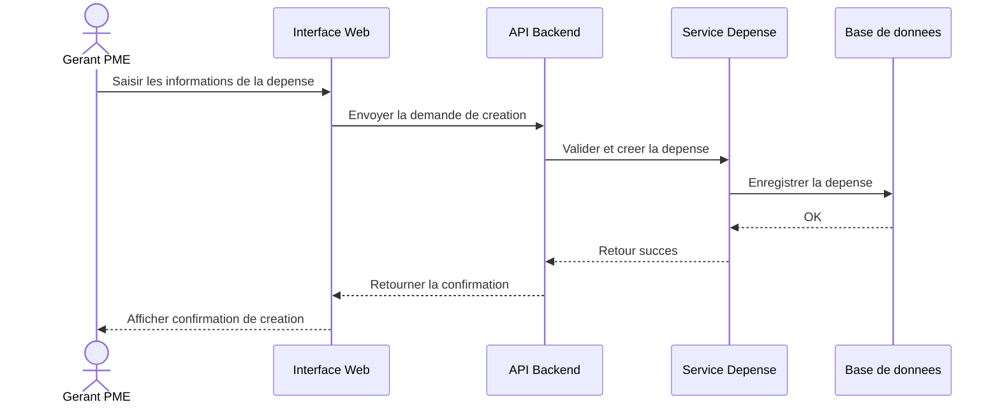
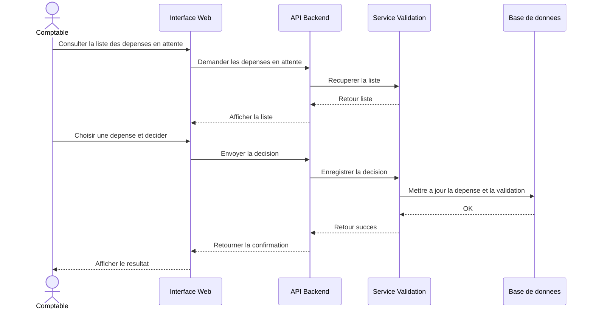

# Dossier projet - FinSmart Pro

## Cadre de certification

Ce dossier projet est prepare dans le cadre du titre professionnel **Concepteur developpeur d'applications**, niveau 6, enregistre sous le code **RNCP37873**.

Reference officielle : [France competences - RNCP37873](https://www.francecompetences.fr/recherche/rncp/37873/).

Le titre est organise en trois blocs de competences :

- `RNCP37873BC01` : developper une application securisee ;
- `RNCP37873BC02` : concevoir et developper une application securisee organisee en couches ;
- `RNCP37873BC03` : preparer le deploiement d'une application securisee.

Le projet FinSmart Pro apporte des preuves pour ces trois blocs. Certaines competences, notamment l'acces NoSQL et l'authentification de niveau production, ne sont pas encore totalement couvertes et sont identifiees comme des axes d'amelioration.

## 1. Introduction

FinSmart Pro est un projet d'application SaaS destinee aux PME. La plateforme a pour objectif de centraliser plusieurs activites financieres dans un outil unique : gestion des depenses, comptabilite, facturation, tresorerie et reporting financier.

Le projet est realise dans un cadre scolaire et s'appuie sur une demarche progressive. La premiere fonctionnalite travaillee est la gestion des depenses, car elle permet de mettre en place un flux complet : saisie, enregistrement, controle et validation.

## 2. Contexte entreprise

Le client fictif du projet est le cabinet **Expertise & Conseil**. Ce cabinet accompagne des petites et moyennes entreprises dans leur gestion administrative, comptable et financiere.

Les PME clientes utilisent souvent plusieurs outils pour suivre leurs depenses, leurs factures et leur tresorerie. Cette organisation peut entrainer une perte de temps, des erreurs de saisie et un manque de visibilite pour le gerant comme pour le comptable.

## 3. Contexte projet

FinSmart Pro vise a proposer une application web centralisee. Elle permet a plusieurs profils d'utilisateurs de travailler sur les memes donnees financieres avec des roles differents.

Les principaux acteurs sont :

- **Gerant PME** : declare les depenses et consulte leur statut ;
- **Comptable** : controle les depenses et prend une decision ;
- **Admin** : gere les utilisateurs, les PME et les categories.

La fonctionnalite de gestion des depenses suit le parcours suivant :

1. le gerant PME saisit une depense ;
2. la depense est enregistree en base de donnees ;
3. le comptable consulte les depenses en attente ;
4. le comptable valide ou refuse la depense ;
5. la decision reste tracee.

## 4. Fin du contexte et enjeux

Le besoin principal du cabinet est de fiabiliser le suivi des depenses. La solution doit permettre de conserver une trace claire des informations saisies et des decisions prises.

Les enjeux du projet sont :

- **fonctionnels** : simplifier la declaration et le controle des depenses ;
- **metier** : ameliorer la collaboration entre gerant PME et comptable ;
- **techniques** : mettre en place une architecture backend, frontend et base de donnees ;
- **qualite** : documenter la conception, tester les fonctionnalites et suivre l'avancement ;
- **evolutivite** : preparer l'ajout futur de l'authentification, des roles, de la facturation et du reporting.

## 5. Problematique

Comment concevoir et developper une application web permettant a une PME de declarer ses depenses et a un comptable de les controler de maniere fiable ?

## 6. Objectifs du projet

### Objectif principal

Fournir une premiere version fonctionnelle de FinSmart Pro autour de la gestion des depenses.

### Objectifs secondaires

- concevoir la base de donnees ;
- modeliser les flux avec des diagrammes UML ;
- developper une API FastAPI ;
- developper une interface React ;
- ajouter des tests backend ;
- preparer le deploiement ;
- documenter les livrables projet et professionnels.

## 7. Perimetre fonctionnel actuel

Le perimetre travaille pour ce rendu concerne la gestion des depenses :

- creation d'une depense ;
- consultation des depenses ;
- filtrage par statut ;
- validation d'une depense ;
- refus d'une depense ;
- suivi de la decision.

Les statuts utilises sont :

- `EN_ATTENTE` ou `pending` : depense en attente de decision ;
- `VALIDE` ou `approved` : depense acceptee ;
- `REFUSE` ou `rejected` : depense refusee.

## 8. Architecture technique

| Couche | Technologie |
| --- | --- |
| Backend | Python FastAPI |
| Frontend | React avec Vite |
| Base de donnees | PostgreSQL |
| ORM | SQLAlchemy |
| Validation | Pydantic |
| Tests | Pytest, Ruff, ESLint |
| CI/CD | GitHub Actions |
| Conteneurisation | Docker, Docker Compose |

## 9. Methodologie projet

Le projet est organise avec une demarche agile simplifiee. La backlog est suivie dans les tickets GitHub du repository.

Chaque evolution doit etre traitee avec un commit atomique : une fonctionnalite, une correction ou une mise a jour documentaire par commit.

### Organisation du travail

Le travail est decoupe en sprints avec :

- un objectif de sprint ;
- une backlog priorisee ;
- des tickets GitHub ;
- des commits atomiques ;
- des tests associes aux fonctionnalites ;
- un bilan de sprint.

### Correspondance avec les competences RNCP

| Bloc RNCP | Competence attendue | Realisation FinSmart | Preuve |
| --- | --- | --- | --- |
| BC01 | Installer et configurer l'environnement | Environnement Python, Node.js, Docker et PostgreSQL | `requirements.txt`, `frontend/package.json`, `docker-compose.yml` |
| BC01 | Developper des interfaces utilisateur | Connexion, depenses, facturation et navigation React | `frontend/src/App.jsx`, `frontend/src/styles.css` |
| BC01 | Developper des composants metier | Creation, validation et refus des depenses ; creation des factures | `main.py`, `models.py`, `schemas.py` |
| BC01 | Contribuer a la gestion du projet | Backlog, issues GitHub, sprints et commits atomiques | `livrables/backlog.md`, GitHub Issues |
| BC02 | Analyser les besoins et maquetter | Acteurs, parcours, perimetre fonctionnel et interfaces | Sections 2 a 7 du dossier |
| BC02 | Definir l'architecture logicielle | Architecture React, FastAPI, SQLAlchemy et PostgreSQL | Section 8 et diagrammes |
| BC02 | Concevoir une base relationnelle | Modeles PME, utilisateurs, depenses et factures | `models.py`, MCD, MLD et MPD |
| BC02 | Developper l'acces aux donnees | Endpoints REST et requetes SQLAlchemy | `main.py`, `database.py` |
| BC03 | Preparer et executer les tests | Tests Pytest, Ruff, ESLint et build Vite | `tests/`, commandes de qualite |
| BC03 | Preparer le deploiement | Dockerfile, Docker Compose et documentation staging | `Dockerfile`, `docker-compose.staging.yml`, `docs/deploiement-staging.md` |
| BC03 | Contribuer a une demarche DevOps | Integration continue avec GitHub Actions | `.github/workflows/ci.yml` |

## 10. Demarrage de la conception

La conception est basee sur les diagrammes prepares pour le rendu du 23/04 :

- dictionnaire de donnees ;
- MCD ;
- MLD ;
- MPD ;
- diagramme de classes ;
- diagramme de sequence de creation d'une depense ;
- diagramme de sequence de validation ou refus d'une depense.

## 11. Dictionnaire de donnees

| Donnee | Description | Type | Contraintes | Exemple |
| --- | --- | --- | --- | --- |
| `id_utilisateur` | Identifiant unique de l'utilisateur | Entier | PK, NN | 1 |
| `nom` | Nom de l'utilisateur | Chaine | NN | Dupont |
| `email` | Email de connexion | Chaine | UQ, NN | dupont@mail.com |
| `mot_de_passe` | Mot de passe hashe | Chaine | NN | $2b$10$... |
| `role` | Role de l'utilisateur | Chaine | NN | GERANT_PME |
| `id_pme` | Identifiant unique de la PME | Entier | PK, NN | 2 |
| `nom_pme` | Nom de la PME | Chaine | NN | Alpha SARL |
| `id_depense` | Identifiant unique de la depense | Entier | PK, NN | 15 |
| `libelle` | Libelle de la depense | Chaine | NN | Achat fournitures |
| `montant` | Montant de la depense | Decimal | NN | 2500.00 |
| `date_depense` | Date de la depense | Date | NN | 2025-04-15 |
| `statut` | Statut de la depense | Chaine | NN | EN_ATTENTE |
| `id_categorie` | Identifiant unique de la categorie | Entier | PK, NN | 3 |
| `nom_categorie` | Nom de la categorie | Chaine | NN | Fournitures |
| `id_validation` | Identifiant de la validation | Entier | PK, NN | 8 |
| `decision` | Decision prise sur la depense | Chaine | NN | VALIDE |
| `date_decision` | Date de la decision | Date | NN | 2025-04-17 |
| `commentaire_validation` | Commentaire sur la decision | Chaine | Optionnel | Conforme |

## 12. MCD - Modele Conceptuel de Donnees

Le MCD presente les entites metier sans cle etrangere. Les relations sont exprimees avec des associations.

Entites principales :

- `UTILISATEUR` : represente un utilisateur de l'application ;
- `PME` : represente une entreprise cliente ;
- `DEPENSE` : represente une depense declaree ;
- `CATEGORIE` : permet de classer une depense ;
- `VALIDATION` : represente la decision prise par le comptable.

Associations :

- un `UTILISATEUR` cree une ou plusieurs `DEPENSES` ;
- une `PME` est concernee par une ou plusieurs `DEPENSES` ;
- une `DEPENSE` appartient a une `CATEGORIE` ;
- une `DEPENSE` fait l'objet d'une `VALIDATION`.

## 13. MLD - Modele Logique de Donnees

Le MLD ajoute les relations entre les tables, sans detailler le typage physique.

```text
utilisateur(
  id_utilisateur PK,
  nom,
  email,
  mot_de_passe,
  role,
  id_pme FK
)

pme(
  id_pme PK,
  nom_pme
)

categorie(
  id_categorie PK,
  nom_categorie
)

depense(
  id_depense PK,
  libelle,
  montant,
  date_depense,
  statut,
  commentaire,
  id_utilisateur FK,
  id_pme FK,
  id_categorie FK
)

validation(
  id_validation PK,
  decision,
  date_decision,
  commentaire_validation,
  id_depense FK
)
```

Relations :

- `utilisateur.id_pme` reference `pme.id_pme` ;
- `depense.id_utilisateur` reference `utilisateur.id_utilisateur` ;
- `depense.id_pme` reference `pme.id_pme` ;
- `depense.id_categorie` reference `categorie.id_categorie` ;
- `validation.id_depense` reference `depense.id_depense`.

## 14. MPD - Modele Physique de Donnees

Le MPD precise les types SQL retenus pour l'implementation.

```sql
CREATE TABLE pme (
  id_pme SERIAL PRIMARY KEY,
  nom_pme VARCHAR(150) NOT NULL
);

CREATE TABLE utilisateur (
  id_utilisateur SERIAL PRIMARY KEY,
  nom VARCHAR(100) NOT NULL,
  email VARCHAR(100) NOT NULL UNIQUE,
  mot_de_passe VARCHAR(255) NOT NULL,
  role VARCHAR(20) NOT NULL,
  id_pme INT REFERENCES pme(id_pme)
);

CREATE TABLE categorie (
  id_categorie SERIAL PRIMARY KEY,
  nom_categorie VARCHAR(100) NOT NULL
);

CREATE TABLE depense (
  id_depense SERIAL PRIMARY KEY,
  libelle VARCHAR(255) NOT NULL,
  montant DECIMAL(12,2) NOT NULL,
  date_depense DATE NOT NULL,
  statut VARCHAR(20) NOT NULL,
  commentaire VARCHAR(255),
  id_utilisateur INT REFERENCES utilisateur(id_utilisateur),
  id_pme INT REFERENCES pme(id_pme),
  id_categorie INT REFERENCES categorie(id_categorie)
);

CREATE TABLE validation (
  id_validation SERIAL PRIMARY KEY,
  decision VARCHAR(10) NOT NULL,
  date_decision DATE NOT NULL,
  commentaire_validation VARCHAR(255),
  id_depense INT REFERENCES depense(id_depense)
);
```

## 15. Diagramme de classes



## 16. Diagramme de sequence - creer une depense



## 17. Diagramme de sequence - valider ou refuser une depense



## 18. Avancement Sprint 2

Pendant le Sprint 2, le projet a evolue au-dela de la simple gestion des depenses. L'application integre maintenant un prototype plus complet avec :

- une connexion demo cote backend avec l'endpoint `POST /auth/login` ;
- des roles utilisateurs : `admin`, `gerant_pme`, `comptable` ;
- une protection minimale des routes sensibles selon le role ;
- un endpoint de categories de depenses utilise par le frontend ;
- une base de donnees de demonstration avec PME, utilisateurs, depenses et factures ;
- un module de facturation de base ;
- 12 tests backend associes aux fonctionnalites principales.

La securisation complete avec token, session et hash reel des mots de passe est identifiee comme une evolution de Sprint 3 ou de durcissement technique.

## 19. Architecture applicative en couches

FinSmart Pro utilise une architecture web organisee en couches :

| Couche | Responsabilite | Technologie |
| --- | --- | --- |
| Presentation | Affichage des vues et interactions utilisateur | React, Vite, CSS |
| API | Exposition des routes HTTP et controle des entrees | FastAPI, Pydantic |
| Metier | Regles de creation, validation, refus et controle des roles | Python |
| Acces aux donnees | Requetes et persistance des objets | SQLAlchemy |
| Donnees | Stockage relationnel | PostgreSQL |
| Infrastructure | Execution locale, staging et integration continue | Docker, Docker Compose, GitHub Actions |

Cette separation facilite la maintenance, les tests et les evolutions futures. Le frontend ne communique pas directement avec PostgreSQL : il passe par l'API FastAPI.

## 20. Developpements realises

### Gestion des depenses

- creation et consultation des depenses ;
- filtrage par statut ;
- validation ou refus par un profil autorise ;
- controle d'une depense deja traitee ;
- categories chargees depuis l'API.

### Gestion des utilisateurs et des roles

- utilisateurs de demonstration en base ;
- roles `admin`, `gerant_pme` et `comptable` ;
- endpoint de connexion demo ;
- protection minimale des actions sensibles selon le role.

### Facturation

- creation et consultation des factures ;
- statuts brouillon, envoyee, payee et en retard ;
- filtrage par statut ;
- calcul et affichage du total TTC cote interface.

## 21. Securite de l'application

La securite est prise en compte progressivement :

- validation des donnees d'entree avec Pydantic ;
- controle des montants positifs ;
- controle des roles pour les actions sensibles ;
- refus des identifiants invalides ;
- limitation des origines CORS au frontend local ;
- variables d'environnement pour la connexion a la base ;
- absence de mot de passe en clair dans les reponses API.

### Limites actuelles

L'authentification utilise encore un mecanisme de demonstration avec le header `X-User-Email`. Cette solution permet de tester les roles, mais elle n'est pas adaptee a la production.

Les ameliorations prevues sont :

- hash reel des mots de passe avec une bibliotheque adaptee ;
- token signe ou session securisee ;
- expiration et renouvellement de session ;
- protection de toutes les routes privees ;
- journalisation des actions sensibles ;
- gestion securisee des secrets de production.

## 22. Strategie de tests

Les tests sont ajoutes en parallele des developpements. Ils utilisent une base SQLite en memoire afin d'isoler les scenarios.

| Fonctionnalite | Verification |
| --- | --- |
| Depenses | Creation, validation et blocage d'une seconde decision |
| Utilisateurs | Filtrage par role |
| Authentification | Connexion valide et rejet d'un mauvais mot de passe |
| Autorisations | Refus de creation d'une facture pour un role non autorise |
| Categories | Presence des categories et compteur d'utilisation |
| Facturation | Creation, filtrage par statut et refus d'un montant negatif |

Commandes de verification :

```powershell
pytest
ruff check .
cd frontend
npm run lint
npm run build
```

Au terme du Sprint 2, la suite comprend 12 tests backend. Les tests frontend automatises restent a ajouter.

## 23. Deploiement et demarche DevOps

Le projet comprend :

- un `Dockerfile` pour construire l'image de l'API ;
- un `docker-compose.yml` pour l'API et PostgreSQL ;
- un `docker-compose.staging.yml` pour preparer un environnement de staging ;
- un pipeline GitHub Actions pour executer les controles backend et frontend ;
- une documentation de deploiement dans `docs/deploiement-staging.md`.

Le deploiement public final reste a stabiliser. Le lien de production devra etre ajoute au README lorsque l'environnement sera valide.

## 24. Qualite, accessibilite et eco-conception

### Qualite

- conventions de code verifiees avec Ruff et ESLint ;
- composants et fonctions nommes selon leur responsabilite ;
- commits decoupes par fonctionnalite ou documentation ;
- documentation technique conservee dans le repository.

### Accessibilite

L'interface utilise des labels de formulaire, des boutons natifs, des titres hierarchises et des attributs ARIA sur certaines zones. Les prochaines verifications devront porter sur :

- la navigation complete au clavier ;
- le contraste des couleurs ;
- les messages d'erreur annonces aux technologies d'assistance ;
- le comportement responsive avec zoom.

### Eco-conception

Les choix actuels limitent la complexite du prototype : interface sans animation lourde, appels API simples et dependances frontend limitees. Les prochaines actions seront de mesurer le poids des ressources, reduire les appels inutiles et optimiser les images.

## 25. Protection des donnees

FinSmart manipule des donnees financieres et des informations d'utilisateur. Dans un contexte reel, les principes suivants devront etre appliques :

- minimisation des donnees collectees ;
- information des utilisateurs ;
- limitation de la duree de conservation ;
- controle des acces selon le role ;
- sauvegarde et restauration de la base ;
- droit d'acces, de rectification et de suppression ;
- journalisation sans exposition de donnees sensibles.

Les donnees presentes dans le projet sont des donnees fictives de demonstration.

## 26. Bilan des competences et axes a completer

| Competence | Niveau de couverture |
| --- | --- |
| Developpement frontend securise | Couvert pour le prototype |
| Developpement backend et composants metier | Couvert |
| Architecture applicative en couches | Couvert |
| Base de donnees relationnelle | Couvert |
| Acces aux donnees SQL | Couvert |
| Acces a une base NoSQL | Non couvert par FinSmart |
| Tests backend | Couvert |
| Tests frontend automatises | A completer |
| Deploiement conteneurise | Prepare et documente |
| Authentification de production | A completer |
| Demarche DevOps | Couvert par la CI |

## 27. Conclusion provisoire

Le dossier projet couvre maintenant le contexte, l'analyse du besoin, la conception, l'architecture en couches, les developpements, la securite, les tests et la preparation du deploiement. Il met egalement en correspondance les realisations FinSmart avec les trois blocs du titre RNCP37873.

La suite du travail consiste a produire les preuves visuelles, finaliser les diagrammes avec la facturation, renforcer l'authentification et developper le dashboard financier du Sprint 3.
