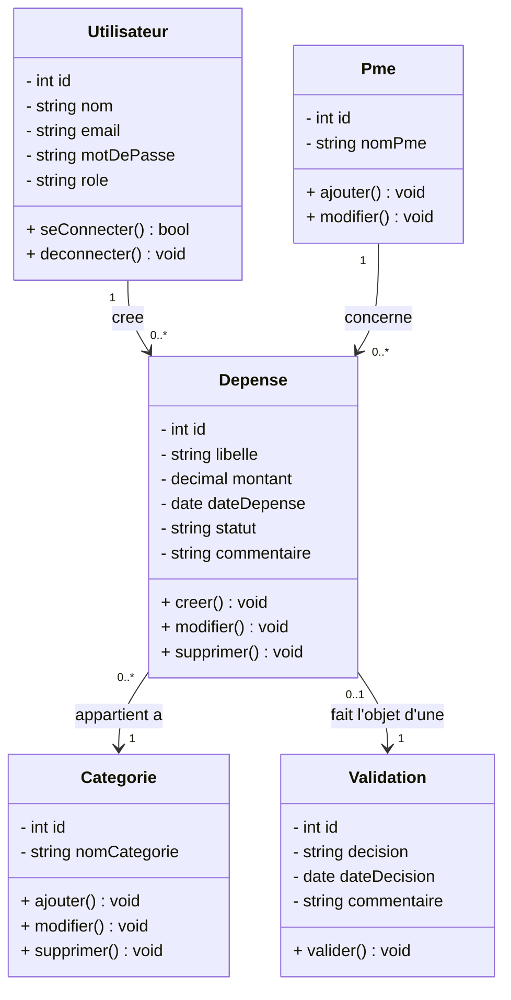
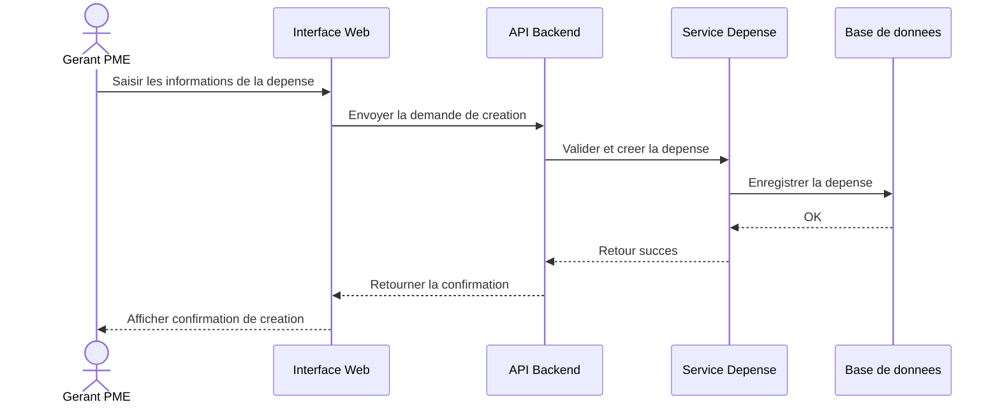
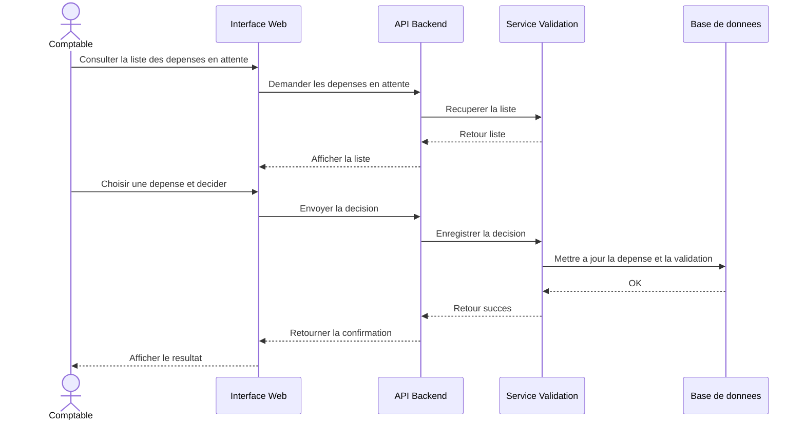

# Dossier projet - FinSmart Pro

## 1. Introduction

FinSmart Pro est un projet d'application SaaS destinee aux PME. La plateforme a pour objectif de centraliser plusieurs activites financieres dans un outil unique : gestion des depenses, comptabilite, facturation, tresorerie et reporting financier.

Le projet est realise dans un cadre scolaire et s'appuie sur une demarche progressive. La premiere fonctionnalite travaillee est la gestion des depenses, car elle permet de mettre en place un flux complet : saisie, enregistrement, controle et validation.

## 2. Contexte entreprise

Le client fictif du projet est le cabinet **Expertise & Conseil**. Ce cabinet accompagne des petites et moyennes entreprises dans leur gestion administrative, comptable et financiere.

Les PME clientes utilisent souvent plusieurs outils pour suivre leurs depenses, leurs factures et leur tresorerie. Cette organisation peut entrainer une perte de temps, des erreurs de saisie et un manque de visibilite pour le gerant comme pour le comptable.

## 3. Contexte projet

FinSmart Pro vise a proposer une application web centralisee. Elle permet a plusieurs profils d'utilisateurs de travailler sur les memes donnees financieres avec des roles differents.

Les principaux acteurs sont :

- **Gerant PME** : declare les depenses et consulte leur statut ;
- **Comptable** : controle les depenses et prend une decision ;
- **Admin** : gere les utilisateurs, les PME et les categories.

La fonctionnalite de gestion des depenses suit le parcours suivant :

1. le gerant PME saisit une depense ;
2. la depense est enregistree en base de donnees ;
3. le comptable consulte les depenses en attente ;
4. le comptable valide ou refuse la depense ;
5. la decision reste tracee.

## 4. Fin du contexte et enjeux

Le besoin principal du cabinet est de fiabiliser le suivi des depenses. La solution doit permettre de conserver une trace claire des informations saisies et des decisions prises.

Les enjeux du projet sont :

- **fonctionnels** : simplifier la declaration et le controle des depenses ;
- **metier** : ameliorer la collaboration entre gerant PME et comptable ;
- **techniques** : mettre en place une architecture backend, frontend et base de donnees ;
- **qualite** : documenter la conception, tester les fonctionnalites et suivre l'avancement ;
- **evolutivite** : preparer l'ajout futur de l'authentification, des roles, de la facturation et du reporting.

## 5. Problematique

Comment concevoir et developper une application web permettant a une PME de declarer ses depenses et a un comptable de les controler de maniere fiable ?

## 6. Objectifs du projet

### Objectif principal

Fournir une premiere version fonctionnelle de FinSmart Pro autour de la gestion des depenses.

### Objectifs secondaires

- concevoir la base de donnees ;
- modeliser les flux avec des diagrammes UML ;
- developper une API FastAPI ;
- developper une interface React ;
- ajouter des tests backend ;
- preparer le deploiement ;
- documenter les livrables projet et professionnels.

## 7. Perimetre fonctionnel actuel

Le perimetre travaille pour ce rendu concerne la gestion des depenses :

- creation d'une depense ;
- consultation des depenses ;
- filtrage par statut ;
- validation d'une depense ;
- refus d'une depense ;
- suivi de la decision.

Les statuts utilises sont :

- `EN_ATTENTE` ou `pending` : depense en attente de decision ;
- `VALIDE` ou `approved` : depense acceptee ;
- `REFUSE` ou `rejected` : depense refusee.

## 8. Architecture technique

| Couche | Technologie |
| --- | --- |
| Backend | Python FastAPI |
| Frontend | React avec Vite |
| Base de donnees | PostgreSQL |
| ORM | SQLAlchemy |
| Validation | Pydantic |
| Tests | Pytest, Ruff, ESLint |
| CI/CD | GitHub Actions |
| Conteneurisation | Docker, Docker Compose |

## 9. Methodologie projet

Le projet est organise avec une demarche agile simplifiee. La backlog est suivie dans les tickets GitHub du repository.

Chaque evolution doit etre traitee avec un commit atomique : une fonctionnalite, une correction ou une mise a jour documentaire par commit.

## 10. Demarrage de la conception

La conception est basee sur les diagrammes prepares pour le rendu du 23/04 :

- dictionnaire de donnees ;
- MCD ;
- MLD ;
- MPD ;
- diagramme de classes ;
- diagramme de sequence de creation d'une depense ;
- diagramme de sequence de validation ou refus d'une depense.

## 11. Dictionnaire de donnees

| Donnee | Description | Type | Contraintes | Exemple |
| --- | --- | --- | --- | --- |
| `id_utilisateur` | Identifiant unique de l'utilisateur | Entier | PK, NN | 1 |
| `nom` | Nom de l'utilisateur | Chaine | NN | Dupont |
| `email` | Email de connexion | Chaine | UQ, NN | dupont@mail.com |
| `mot_de_passe` | Mot de passe hashe | Chaine | NN | $2b$10$... |
| `role` | Role de l'utilisateur | Chaine | NN | GERANT_PME |
| `id_pme` | Identifiant unique de la PME | Entier | PK, NN | 2 |
| `nom_pme` | Nom de la PME | Chaine | NN | Alpha SARL |
| `id_depense` | Identifiant unique de la depense | Entier | PK, NN | 15 |
| `libelle` | Libelle de la depense | Chaine | NN | Achat fournitures |
| `montant` | Montant de la depense | Decimal | NN | 2500.00 |
| `date_depense` | Date de la depense | Date | NN | 2025-04-15 |
| `statut` | Statut de la depense | Chaine | NN | EN_ATTENTE |
| `id_categorie` | Identifiant unique de la categorie | Entier | PK, NN | 3 |
| `nom_categorie` | Nom de la categorie | Chaine | NN | Fournitures |
| `id_validation` | Identifiant de la validation | Entier | PK, NN | 8 |
| `decision` | Decision prise sur la depense | Chaine | NN | VALIDE |
| `date_decision` | Date de la decision | Date | NN | 2025-04-17 |
| `commentaire_validation` | Commentaire sur la decision | Chaine | Optionnel | Conforme |

## 12. MCD - Modele Conceptuel de Donnees

Le MCD presente les entites metier sans cle etrangere. Les relations sont exprimees avec des associations.

Entites principales :

- `UTILISATEUR` : represente un utilisateur de l'application ;
- `PME` : represente une entreprise cliente ;
- `DEPENSE` : represente une depense declaree ;
- `CATEGORIE` : permet de classer une depense ;
- `VALIDATION` : represente la decision prise par le comptable.

Associations :

- un `UTILISATEUR` cree une ou plusieurs `DEPENSES` ;
- une `PME` est concernee par une ou plusieurs `DEPENSES` ;
- une `DEPENSE` appartient a une `CATEGORIE` ;
- une `DEPENSE` fait l'objet d'une `VALIDATION`.

## 13. MLD - Modele Logique de Donnees

Le MLD ajoute les relations entre les tables, sans detailler le typage physique.

```text
utilisateur(
  id_utilisateur PK,
  nom,
  email,
  mot_de_passe,
  role,
  id_pme FK
)

pme(
  id_pme PK,
  nom_pme
)

categorie(
  id_categorie PK,
  nom_categorie
)

depense(
  id_depense PK,
  libelle,
  montant,
  date_depense,
  statut,
  commentaire,
  id_utilisateur FK,
  id_pme FK,
  id_categorie FK
)

validation(
  id_validation PK,
  decision,
  date_decision,
  commentaire_validation,
  id_depense FK
)
```

Relations :

- `utilisateur.id_pme` reference `pme.id_pme` ;
- `depense.id_utilisateur` reference `utilisateur.id_utilisateur` ;
- `depense.id_pme` reference `pme.id_pme` ;
- `depense.id_categorie` reference `categorie.id_categorie` ;
- `validation.id_depense` reference `depense.id_depense`.

## 14. MPD - Modele Physique de Donnees

Le MPD precise les types SQL retenus pour l'implementation.

```sql
CREATE TABLE pme (
  id_pme SERIAL PRIMARY KEY,
  nom_pme VARCHAR(150) NOT NULL
);

CREATE TABLE utilisateur (
  id_utilisateur SERIAL PRIMARY KEY,
  nom VARCHAR(100) NOT NULL,
  email VARCHAR(100) NOT NULL UNIQUE,
  mot_de_passe VARCHAR(255) NOT NULL,
  role VARCHAR(20) NOT NULL,
  id_pme INT REFERENCES pme(id_pme)
);

CREATE TABLE categorie (
  id_categorie SERIAL PRIMARY KEY,
  nom_categorie VARCHAR(100) NOT NULL
);

CREATE TABLE depense (
  id_depense SERIAL PRIMARY KEY,
  libelle VARCHAR(255) NOT NULL,
  montant DECIMAL(12,2) NOT NULL,
  date_depense DATE NOT NULL,
  statut VARCHAR(20) NOT NULL,
  commentaire VARCHAR(255),
  id_utilisateur INT REFERENCES utilisateur(id_utilisateur),
  id_pme INT REFERENCES pme(id_pme),
  id_categorie INT REFERENCES categorie(id_categorie)
);

CREATE TABLE validation (
  id_validation SERIAL PRIMARY KEY,
  decision VARCHAR(10) NOT NULL,
  date_decision DATE NOT NULL,
  commentaire_validation VARCHAR(255),
  id_depense INT REFERENCES depense(id_depense)
);
```

## 15. Diagramme de classes



## 16. Diagramme de sequence - creer une depense



## 17. Diagramme de sequence - valider ou refuser une depense



## 18. Conclusion provisoire

Le dossier projet contient maintenant la fin du contexte et le demarrage de la conception. Les diagrammes existants permettent de justifier la structure de la base de donnees et les premiers flux fonctionnels.

La suite du travail consiste a finaliser les diagrammes, ajouter l'authentification, securiser les roles et poursuivre le developpement de l'application.
