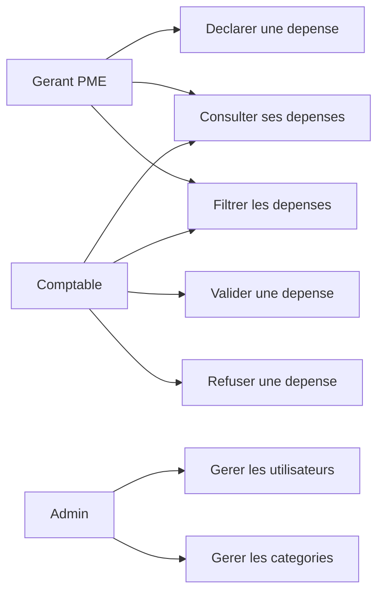
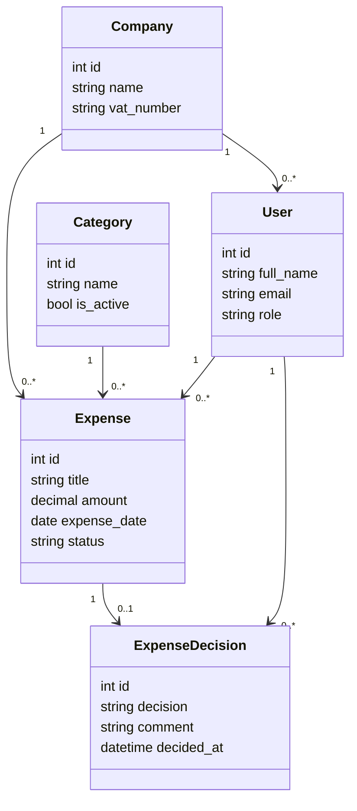
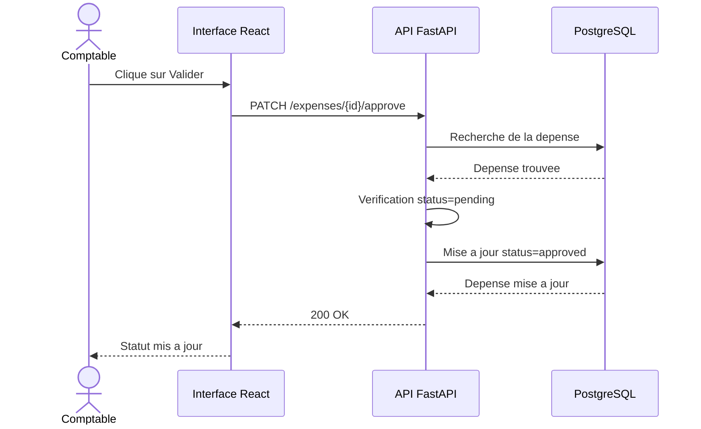

# Dossier projet - FinSmart Pro

## 1. Introduction

FinSmart Pro est un projet d'application SaaS destinee aux PME. La plateforme a pour objectif de centraliser plusieurs activites financieres dans un outil unique : gestion des depenses, comptabilite, facturation, tresorerie et reporting.

Le projet est realise dans un cadre scolaire et s'appuie sur une demarche progressive. Une premiere fonctionnalite a ete developpee pendant le Sprint 1 : la gestion des depenses.

## 2. Contexte entreprise

Le client fictif du projet est le cabinet **Expertise & Conseil**.

Ce cabinet accompagne des petites et moyennes entreprises dans leur gestion administrative, comptable et financiere. Ses clients doivent souvent utiliser plusieurs outils differents pour suivre leurs factures, leurs depenses, leur tresorerie et leurs bilans.

Cette dispersion des outils peut provoquer :

- une perte de temps ;
- des erreurs de saisie ;
- un manque de visibilite sur les depenses ;
- des difficultes a produire des rapports fiables ;
- une collaboration moins fluide entre les gerants et les comptables.

Le cabinet souhaite donc disposer d'une solution moderne pour simplifier le suivi financier de ses clients.

## 3. Contexte projet

FinSmart Pro repond a ce besoin en proposant une plateforme web centralisee.

La solution doit permettre a plusieurs profils d'utilisateurs de travailler sur les memes donnees financieres, avec des droits adaptes :

- **Admin** : gere les utilisateurs, les PME et la configuration ;
- **Gerant PME** : saisit les depenses et consulte ses donnees ;
- **Comptable** : controle, categorise, valide ou refuse les depenses.

Le projet commence par la gestion des depenses car cette fonctionnalite represente un flux simple et important :

1. le Gerant PME declare une depense ;
2. la depense est stockee en base ;
3. le Comptable controle la depense ;
4. le Comptable valide ou refuse la depense ;
5. l'historique reste consultable.

## 4. Fin du contexte et enjeux

Le besoin principal du cabinet est de fiabiliser le suivi des depenses et de preparer une base applicative evolutive. La gestion des depenses constitue une premiere brique car elle fait intervenir les principaux elements attendus dans une application professionnelle : saisie utilisateur, validation metier, stockage en base de donnees, controle par un autre role et consultation d'un historique.

Les enjeux identifies sont les suivants :

- **enjeu fonctionnel** : simplifier la declaration et le controle des depenses ;
- **enjeu metier** : reduire les erreurs et ameliorer la tracabilite des decisions ;
- **enjeu technique** : construire une architecture maintenable avec API, frontend et base de donnees ;
- **enjeu securite** : preparer la separation des roles et la protection des actions sensibles ;
- **enjeu qualite** : accompagner les developpements avec des tests et une integration continue.

La solution doit rester simple a utiliser pour un gerant de PME, tout en donnant au comptable les informations necessaires pour prendre une decision fiable.

## 5. Problematique

Comment concevoir une application web permettant aux PME de centraliser et fiabiliser leur gestion financiere, tout en facilitant le travail de controle du cabinet comptable ?

## 6. Objectifs du projet

### Objectif principal

Simplifier la gestion financiere des PME clientes du cabinet Expertise & Conseil.

### Objectifs secondaires

- centraliser les depenses dans une base PostgreSQL ;
- proposer une API claire avec FastAPI ;
- fournir une interface React exploitable ;
- separer les roles utilisateurs ;
- automatiser les tests via une CI ;
- preparer un environnement de staging ;
- documenter la conception et le suivi du projet.

## 7. Perimetre fonctionnel

Le perimetre global du projet comprend :

- gestion des depenses ;
- comptabilite ;
- facturation ;
- tresorerie ;
- reporting ;
- gestion multi-utilisateurs ;
- roles et permissions.

Pour le Sprint 1, le perimetre traite est limite a la gestion des depenses.

## 8. Fonctionnalite realisee au Sprint 1

La fonctionnalite **Gestion des depenses** permet :

- de creer une depense ;
- de consulter la liste des depenses ;
- de filtrer les depenses ;
- de valider une depense ;
- de refuser une depense ;
- d'empecher une deuxieme decision sur une depense deja traitee.

Les statuts utilises sont :

- `pending` : depense en attente ;
- `approved` : depense validee ;
- `rejected` : depense refusee.

## 9. Architecture technique

| Couche | Technologie |
| --- | --- |
| Backend | Python FastAPI |
| Frontend | React avec Vite |
| Base de donnees | PostgreSQL |
| ORM | SQLAlchemy |
| Validation | Pydantic |
| Tests | Pytest, Ruff, ESLint |
| CI/CD | GitHub Actions |
| Conteneurisation | Docker, Docker Compose |

## 10. Methodologie projet

Le projet est organise selon une methode agile de type Scrum simplifiee.

Le travail est decoupe en sprints. Chaque sprint permet de :

- definir des objectifs ;
- selectionner des taches depuis la backlog ;
- developper une partie fonctionnelle ;
- tester les elements produits ;
- faire un bilan ;
- ajuster la backlog pour la suite.

Cette methode permet de construire progressivement le projet et de prendre en compte les retours au fur et a mesure.

## 11. Organisation Sprint 1

### Objectif Sprint 1

Mettre en place la base technique du projet et developper la premiere fonctionnalite : la gestion des depenses.

### Elements realises

- depot GitHub initialise ;
- README professionnel ;
- cahier des charges ;
- backend FastAPI ;
- PostgreSQL via SQLAlchemy ;
- endpoints depenses ;
- tests unitaires ;
- pipeline CI ;
- Dockerfile ;
- configuration staging ;
- frontend React ;
- documentation de conception.

### Bilan Sprint 1

Le Sprint 1 est considere comme termine car la fonctionnalite principale est developpee, testee et documentee.

Certaines parties restent a poursuivre au Sprint 2 :

- authentification ;
- roles utilisateurs ;
- securisation des endpoints ;
- deploiement reel sur VPS ;
- finalisation des tests d'integration frontend/backend.

## 12. Organisation Sprint 2

Le Sprint 2 doit renforcer la fonctionnalite existante.

Les priorites sont :

- finaliser l'integration frontend/backend ;
- ajouter une authentification ;
- mettre en place les roles ;
- securiser les actions selon les profils ;
- tester le staging ;
- mettre a jour la documentation.

## 13. Demarrage de la conception

La conception est demarree autour de la fonctionnalite de gestion des depenses. Elle sert de base pour structurer les futures fonctionnalites de FinSmart Pro.

Les elements de conception produits ou en cours sont :

- identification des acteurs ;
- regles metier de la depense ;
- modele de donnees initial ;
- diagrammes UML de cas d'utilisation ;
- diagrammes de sequence pour la creation et la validation ;
- premiere version du modele logique de donnees.

## 14. Conception BDD

### Entites principales prevues

| Entite | Role |
| --- | --- |
| `users` | Stocker les comptes utilisateurs et leurs roles |
| `companies` | Representer les PME clientes du cabinet |
| `expenses` | Stocker les depenses declarees par les gerants |
| `expense_decisions` | Tracer les validations ou refus comptables |
| `categories` | Classer les depenses par nature comptable |

### Modele logique de donnees initial

```text
companies
- id PK
- name
- vat_number
- created_at

users
- id PK
- company_id FK nullable
- full_name
- email
- password_hash
- role
- created_at

categories
- id PK
- name
- is_active

expenses
- id PK
- company_id FK
- category_id FK nullable
- title
- description
- amount
- expense_date
- receipt_url
- status
- created_by_user_id FK
- created_at
- updated_at

expense_decisions
- id PK
- expense_id FK
- decided_by_user_id FK
- decision
- comment
- decided_at
```

### Contraintes metier BDD

- une depense appartient a une seule PME ;
- une depense est creee par un utilisateur de type Gerant PME ;
- une depense commence avec le statut `pending` ;
- une decision comptable transforme la depense en `approved` ou `rejected` ;
- une depense deja traitee ne doit pas recevoir une seconde decision ;
- le montant d'une depense doit etre superieur a zero.

## 15. Conception UML

### Diagramme de cas d'utilisation



### Diagramme de classes simplifie



### Diagramme de sequence - validation d'une depense



## 16. Conclusion provisoire

Le projet FinSmart Pro dispose maintenant d'une base technique solide et d'une premiere fonctionnalite concrete. La gestion des depenses constitue une premiere brique importante pour la future plateforme financiere.

La suite du projet devra principalement porter sur la securite, les roles, l'authentification, la finalisation de la conception BDD/UML et la mise en conditions de deploiement.
